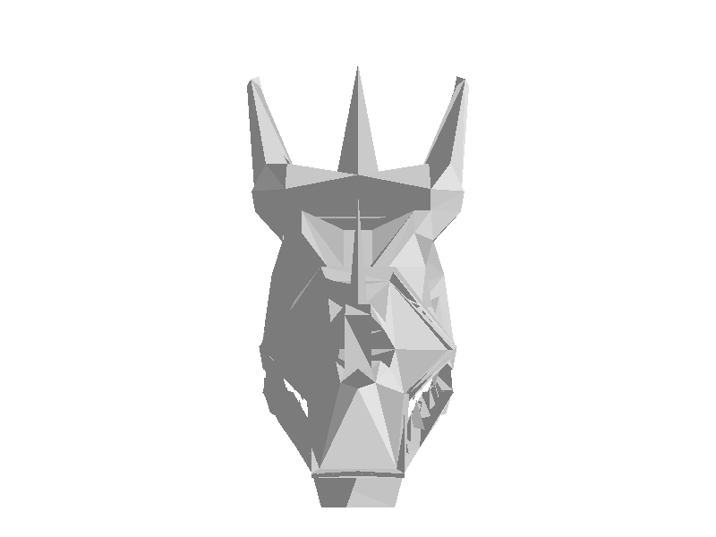
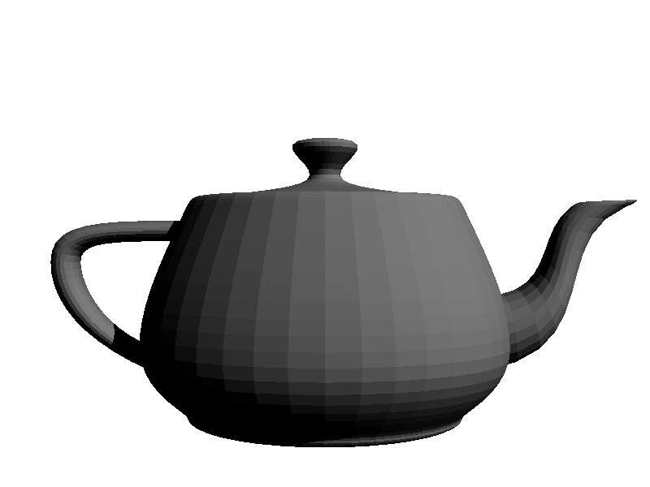

# raytrace

A raytracer implemented in golang for rendering off and obj files.

It uses octrees and bounding boxes in order to optimize the speed with which intersections
must be checked, and also allows for more implementations of intersection algorithms.

---

# Sample Outputs

